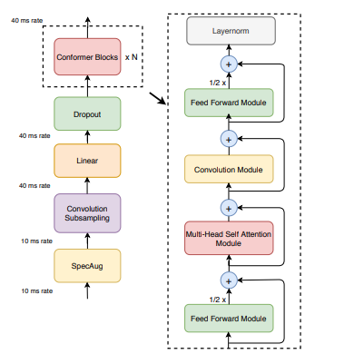

## Classification Tasks
### Credit Score Classification: Case Study
model here :point_right: : [link]()
1. In strong basleine :u7121:
2. TODOs
   * Deal with imbalanced data -> VIF
   * Find the most suitable classifier.
### ML2023-HW3-ImageClassification
model here :point_right: : [link](https://github.com/stephanie0324/ML_practrice/blob/master/Classification/ML2023-HW3-ImageClassification.ipynb)
1. In strong basleine :white_check_mark:
2. TODOs
   * Do some Data Augmentation & Train longer
      * ramdom horizontal flip , random crop
      * epoch -> 80
   * Use predefined CNN from torchvision or TensorFlow 
      *　resnet18
   * Cross Validation + Ensemble or any other methods you know
      * ensemble VGG + resnet (not yet finished)
### ML2023-HW4-SpeakerIdnetification
model here :point_right: : [link]([Classification/ML2023_HW4-SpeakerIdentification.ipynb](https://github.com/stephanie0324/ML_practrice/blob/master/Classification/ML2023_HW4-SpeakerIdentification.ipynb))
1. In strong basleine :white_check_mark:
2. TODOs
   * Build a self-attention network to classify speakers with sample code
   * Modify the parameters of the transformer modules in the sample code. ->** the most effective**
      * add in encoder 
      * modify the predict layer add more linear
   * Construct Conformer, which is a variety of Transformer.
      * change the parameter 
      * implement conformer 
   * Implement Self-Attention Pooling & Additive Margin Softmax to further boost the performance
      * self-attention pooling to replace mean pooling
